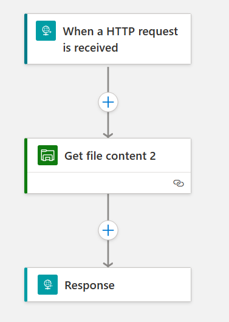
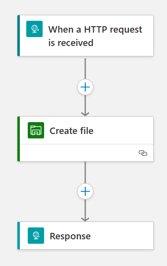
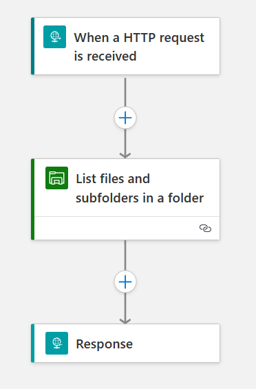

# Azure Logic Apps integration with on-premise SMB file shares

A demonstration of how logic apps can be used to integrate with on-premise [SMB](https://en.wikipedia.org/wiki/Server_Message_Block) file shares

## Why is this a problem?

Azure [Integration Series](https://azure.microsoft.com/en-gb/products/category/integration/) and [Logic Apps](https://learn.microsoft.com/en-us/azure/logic-apps/logic-apps-overview) in particular provide an effecient means for teams to build integrations between systems.

When logic apps are hosted in the standard tier, they use the Azure App Services runtime which exists in a [sandbox](https://github.com/projectkudu/kudu/wiki/Azure-Web-App-sandbox). This sandbox has some network port restrictions - specifically port 445 which is the standard port that the SMB protocol uses. So, when running  a workflow like this:



the "File System" actions (in this case the Get File Contents action) will not be able to "reach" the target SMB server. Thus the workflow will not work corretly.

This behaviour will be the same for web apps or Functions, which also run on the App Service runtime.

What is needed is to avoid this *sandbox* issue, but to still make use of the same set of high-level tooling.

## What can be done?

Logic apps have an [Integration service environment](https://learn.microsoft.com/en-us/azure/logic-apps/ise-manage-integration-service-environment), which is one approach, but this capability is due to be retired on 31st August 2024.

Another approach is to use the single-tenant version of App Service known as the [App Service Environment](https://learn.microsoft.com/en-us/azure/app-service/environment/overview) (ASE) as its runtime does not have the restictions that the multi-tenant App Service does. An ASE v3 is deployed into an Azure virtual network, so it is ready out-of-the-box to send requests to on-premise servers provided that its virtual network is in some way peered that allows routing to the on-premise SMB server.

The rest of this article looks in more detail about how to build a demonstration of this scenario.

## Demonstration Scenario


In the above diagram, the demonstration includes both how to build logic apps inside an ASE as well as a sample target server that implements a file share using the SMB protocol. If you already have a network visible SMB server, you need not create one yourself.

The logic apps in the demonstration provide HTTP API endpoints to allow you to test out SMB access. Your own logic app workloads may not be implemented as HTTP triggered ones, but for the purposes of a demonstration, it provides an easy means of using an HTTP REST client to fire requests against the SMB server.

Looking on the diagram, there are 2 virtual networks (VNets), one containing the ASE and its logic apps and the second one containing the demo virtual machine with a Samba server. The two VNets are [peered](https://learn.microsoft.com/en-us/azure/virtual-network/virtual-network-peering-overview) so that traffic may flow from the ASE's VNet to the virtual machine's VNet. It is important that these VNets are NOT on overlapping address spaces, otherwise the requests will not route over the peering.

The demonstration logic apps have written to:
1. Get the contents of a given file in the SMB share by its filename (an assumprtion is that these are text files)
2. List details of all of the files in the share
3. Add a file of given contents to the share
4. Trigger off a change to the files in the share and store in a blob storage container

The logic apps are all built conventionally on the standard logic apps design surface, but with the logic app created to run in the ASE. To make life easier, the ASE can be provisioned with a public IP address.

## Building the demonstration

The demonstration is in two parts:
1. Building a target SMB server. This is optional if you have one already
2. Building the ASE-hosted logic apps. As part of this some VNet build is also needed.


### Build the VNets

There are two VNets, one for the ASE and the other for the SMB server. These VNets should not have overlapping address spaces.

1. Provision ASE Vnet with a /16 address space
2. Add a /24 subnet for the ASE
3. Provision SMB VNet with a /16 address space (distinct from the ASE VNet)
4. Add a /24 subnet for the virtual machine
5. Peer the SMB server Vnet with the ASE Vnet

Network requests should be able to route from the ASE VNet to the SMMB VNet

### Build the ASE

1. Provision an ASE v3 (you can decide public or ILB - it is easiest to build a public-facing one)
2. Provision an Isolated Service plan against the ASE

At the time of writing, ASE v3 deployment takes some hours. Be prepared to wait for this to complete. The isolated service plan itself also will take approximately an hour too. 

### Build the logic app

Provision a logic app that uses the above isolated service plan. This then can have several different *workflows*. Note that older logic apps had a one-to-one relationship between the logic app and the workflow. In Logic Apps Standard, you define the app and then later build one or more workflows.

### Build the SMB Server virtual machine

The SMB server is really just a virtual machine that runs the SMB service. There is a really helpful external [guide](https://phoenixnap.com/kb/ubuntu-samba) to installing and configuring Samba as an SMB server on a Linux machine. This is the basis for this step.

Steps:
1. Provision a Linux VM - a burstable one can be low cost.
2. This needs to be provisioned inside one of the subnets in the SMB VNet
3. Ubuntu Server 20.04 is a decent choice
4. Install Samba server
5. Configure the server
6. Add a SMB user and give them access control
7. Test on your PC using "Add Network Drive" in Explorer.

It should be notes that the simplest way of managing the VM will be to put a public IP address on the VM. This could be disallowed or could be controlled by policy on your subscription. Another approach is to use [Azure Bastion](https://azure.microsoft.com/en-gb/products/azure-bastion). But you will need to SSH onto the VM to perform the Samba configuration steps.

The SMB server itself is exposed on port 445. To avoid difficulties with exposing this to the Internet, the logic apps will access the SMB server via its private IP address - requests being routed over VNet peering.

### Build the logic app workflows

#### Get File Contents


Request
```
POST https://<your-function-app-name>.<your-ase-name>.p.azurewebsites.net:443/api/<your-workflow-name>/triggers/manual/invoke
Content-Type: application/json

{
    "filename": "another.txt"
}
```

Response
```
HTTP/1.1 200 OK
Connection: close
Content-Type: text/plain; charset=utf-8

hello Dave
```

#### Add a file



Request
```
POST https://<your-function-app-name>.<your-ase-name>.p.azurewebsites.net:443/api/<your-workflow-name>/triggers/manual/invoke
Content-Type: application/json

{
    "filename": "anotherone.txt",
    "textvalue": "hello world"
}
```

#### List files on the share



Request
```
POST https://<your-function-app-name>.<your-ase-name>.p.azurewebsites.net:443/api/<your-workflow-name>/triggers/manual/invoke
Content-Type: application/json

{
}
```

Response
```
HTTP/1.1 200 OK
Connection: close
Content-Type: application/json; charset=utf-8

[
  {
    "createdTime": "2023-01-18T11:30:11.9144949Z",
    "name": "another.txt",
    "path": "/another.txt",
    "size": 0,
    "lastUpdatedTime": "2023-01-18T11:30:11.9144949Z",
    "isFolder": false
  },
  {
    "createdTime": "2023-01-17T16:54:28.6885263Z",
    "name": "test.txt",
    "path": "/test.txt",
    "size": 0,
    "lastUpdatedTime": "2023-01-17T16:54:28.6885263Z",
    "isFolder": false
  },
  {
    "createdTime": "2023-01-18T11:38:38.2342479Z",
    "name": "anotherone.txt",
    "path": "/anotherone.txt",
    "size": 0,
    "lastUpdatedTime": "2023-01-18T11:38:38.2425642Z",
    "isFolder": false
  },
  {
    "createdTime": "2023-01-18T12:09:42.3338062Z",
    "name": "anothertwo.txt",
    "path": "/anothertwo.txt",
    "size": 0,
    "lastUpdatedTime": "2023-01-18T12:09:42.3530267Z",
    "isFolder": false
  }
]
```

#### Triger on file change and copy to blob

This is a future scenarion
