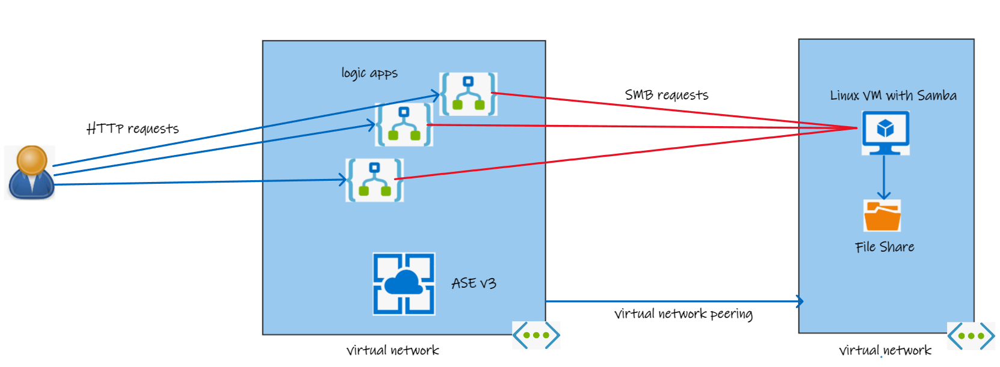

# Azure Logic Apps integration with on-premise SMB file shares

A demonstration of how logic apps can be used to integrate with on-premise SMB file shares

## Why is this a problem?

Azure Integration Series and Logic Apps in particular provide an effecient means for teams to build integrations between systems.

When logic apps are hosted in the standard mode, they use the Azure App Services runtime which exists in a (sandbox)[https://github.com/projectkudu/kudu/wiki/Azure-Web-App-sandbox]. This sandbox has some network port restrictions - specifically port 445 which is the standard port that the SMB protocol uses. So, when running  a workflow like this:

the "File System" actions will not be able to "reach" an SMB server.

